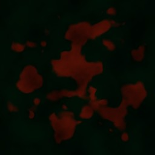
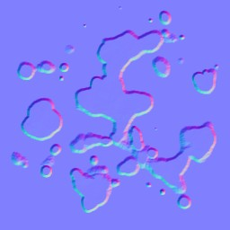
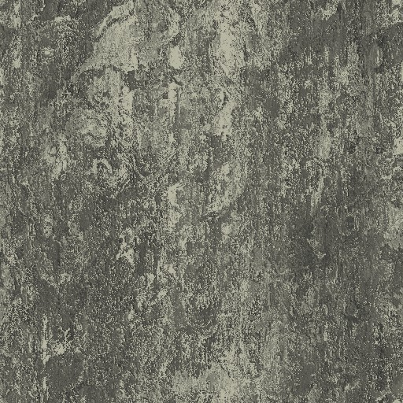
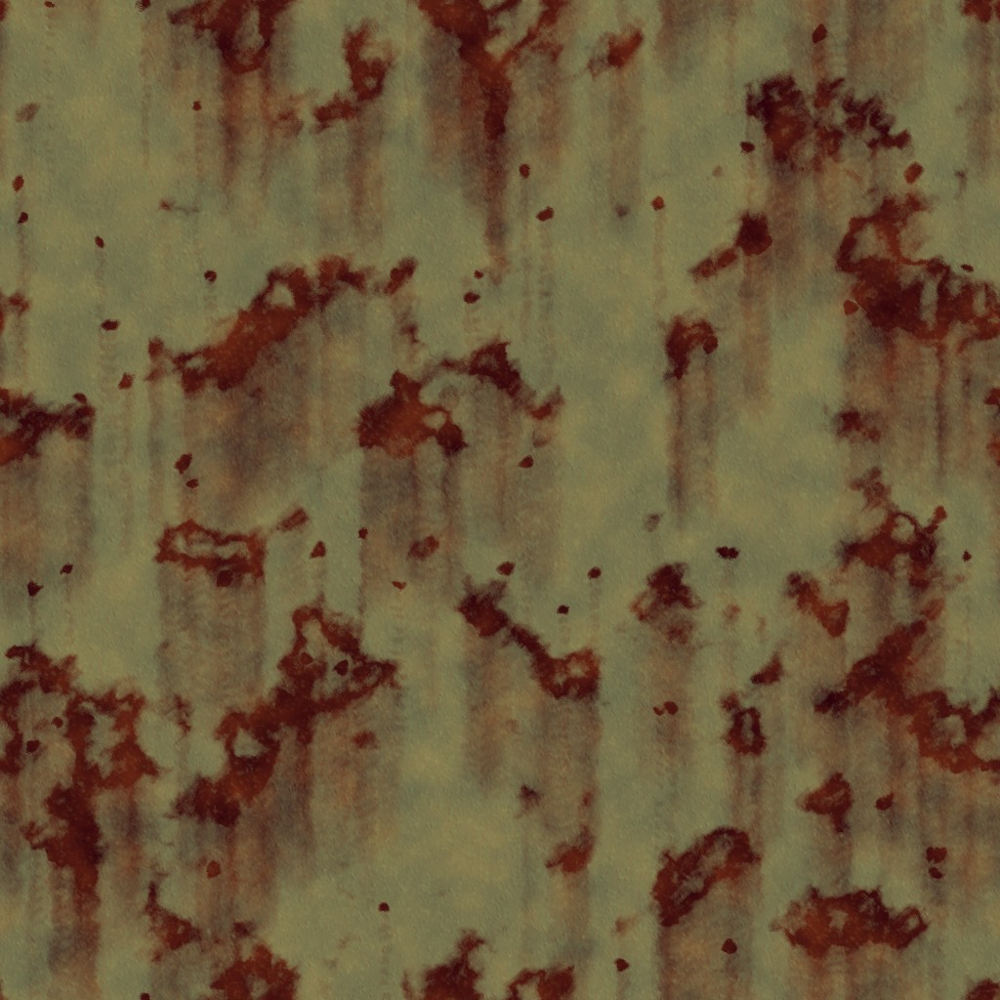

# Texture synthesis sample
This project uses shared Core project (via git submodules) - in case of offline project assembly, please manually sync the Core repository and paste files into the `core` folder.

## Sample description
This sample shows how to use the old (2005-ish) CPU-based texture synthesis framework. Given how the generative neural networks progressed (with slight modification, [neural style transfer project](https://github.com/avoroshilov/neural-style/) could produce example-based synthesized textures, even tileable if to set up convolutions the right way), the texture synthesis framework is somewhat obsolete; however still could be used to see how certain image processing operations could be done.

Examples include:

Blood splatter

Blood splatter normal map

Concrete texture:

Rusty stained metal texture:

## Underlying texture synthesis framework
The framework is a product of old demoscene days, hence it is designed to be fast and small, and doesn't work with the image loading routines, although could be easily modified to support external images too, with the stipulation that they should be rescaled into power-of-2 textures, as it is the core assumption that was made to speed up wrapping operations.

**Key** texture manipulations that provided:
1. Generators:
    1. Oriented rectangles rasterization, and derived bricks pattern generator
    2. Perlin noise
    3. Fractal (octave) noise
    4. Somewhat optimized customized voronoi cells pattern
    5. Custom radial gradients - mostly for particles masks
2. Convolution-based processing:
    1. Sobel filter
    2. Blurs (box, separable gaussian, and pixel-wise directional, although latter is not exactly convolution)
    3. Emboss
    4. Edge detection
3. Random compilation of custom processing filters:
    1. Map distort
    2. Twirl
    3. Lens
    4. Pixelize
4. Color manipulations:
    1. Brightness/contrast/gamma
    2. RGB↔HSV transformations
    3. Color scale
5. Layer blending
    1. Addition/mixmap/screen/lighten/etc.
    2. Shade
    3. Channel exchange

And many more operations.

## Acknowledgments
Huge thanks to Ile/Aardbei for his texture synthesis tutorial, to all authors who published in Hugi demoscene diskmag (check out the coding special edition if you're interested in the demoscene-related knowledge!), to BoyC and Gargaj from Conspiracy for fruitful discussions (including the early GPU-based tex synth), and Farbrausch guys; and to all the demoscene community which is an open and friendly!

## License
Creative Commons Attribution-NonCommercial-ShareAlike 4.0 International Public License